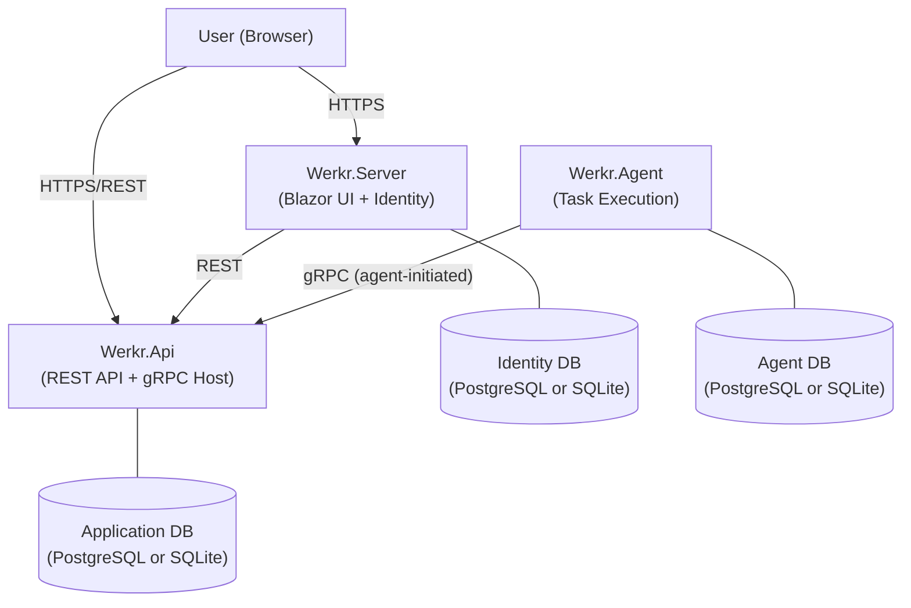
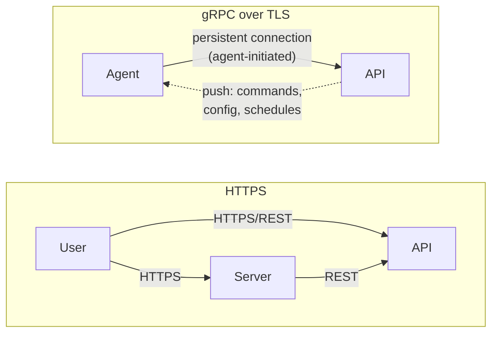
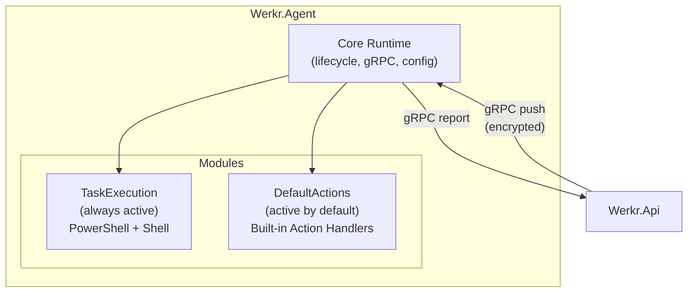
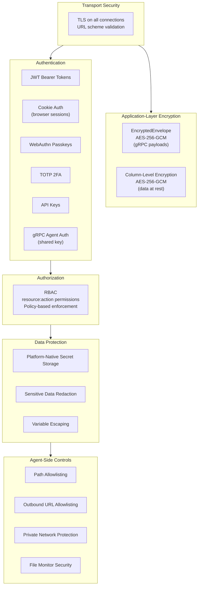

# Architecture

This document describes the stable architectural boundaries of the Werkr project. It covers the system topology, communication model, and key design decisions at a conceptual level. For the definitive 1.0 featureset specification, see [1.0-Target-Featureset.md](1.0-Target-Featureset.md). For vulnerability reporting, see [SECURITY.md](SECURITY.md). For encryption, key management, and secret storage details, see the [Security Architecture](articles/SecurityOverview.md). For build, test, and run instructions, see [Development.md](Development.md). For class-level detail, see the [API documentation](https://docs.werkr.app/api/index.html).

---

## System Overview

Werkr is a self-hosted workflow orchestration platform built on three primary components. The Server and API expose HTTPS endpoints; the API and Agent communicate over encrypted gRPC. After registration and initial heartbeat, agents maintain persistent gRPC connections to the API; the API pushes notifications and commands through these agent-initiated connections. No application-level polling is used for state synchronization.



- **Werkr.Server** — The Blazor Server UI and identity provider. Handles user authentication (ASP.NET Identity with RBAC, TOTP 2FA, and WebAuthn passkeys), renders the management interface via Blazor Server and SignalR, and calls the API over REST. Owns the identity database. Has no direct communication with the Agent.
- **Werkr.Api** — The central application API and workflow orchestrator. Owns the primary application database (tasks, schedules, workflows, triggers, job results, audit logs). Exposes versioned REST endpoints under `/api/v1/` to both end users and the Server. Hosts gRPC services for push-based communication with agents (schedule sync, job reporting, command dispatch, configuration push).
- **Werkr.Agent** — The worker process that executes tasks on remote hosts. Uses a modular architecture with two built-in modules: **TaskExecution** (PowerShell and shell execution) and **DefaultActions** (built-in action handlers). Reports capabilities to the API during registration and via heartbeat. Maintains its own local database for cached state.

---

## Project Map

| Project | Role |
|---------|------|
| `src/Werkr.Server/` | Blazor Server UI, ASP.NET Identity, SignalR hubs, graph-ui TypeScript DAG editor, user authentication and authorization |
| `src/Werkr.Api/` | Versioned REST API, gRPC service host, workflow orchestration, trigger management, connection management |
| `src/Werkr.Agent/` | Modular task execution engine, PowerShell host, shell executor, built-in action handlers, capability registration |
| `src/Werkr.Core/` | Shared business logic — scheduling, workflows, trigger registry, condition evaluator, variable resolution, registration, cryptography, security |
| `src/Werkr.Common/` | Shared models, all protobuf definitions (`Protos/`), auth policies, permission registration, rendering utilities |
| `src/Werkr.Common.Configuration/` | Strongly-typed configuration classes for Server, Agent, and UI settings |
| `src/Werkr.Data/` | EF Core database contexts (PostgreSQL + SQLite), entities, migrations, seeding, audit log entities, retention policies |
| `src/Werkr.Data.Identity/` | ASP.NET Identity EF Core contexts, roles, permissions, API keys, session management, identity entities |
| `src/Werkr.AppHost/` | .NET Aspire orchestrator for local development — wires up PostgreSQL, API, Agent, and Server |
| `src/Werkr.ServiceDefaults/` | Aspire service defaults — OpenTelemetry, health checks, service discovery, resilience |
| `src/Installer/Msi/` | WiX-based MSI installers and custom actions for Windows deployment |

### Project Dependency Graph

```
Werkr.AppHost (Aspire orchestrator)
├── Werkr.Server (Blazor UI)
│   ├── Werkr.Common → Werkr.Common.Configuration
│   └── Werkr.Data.Identity → Werkr.Data → Werkr.Common
├── Werkr.Api (REST + gRPC host)
│   ├── Werkr.Core → Werkr.Data → Werkr.Common → Werkr.Common.Configuration
│   ├── Werkr.Common
│   └── Werkr.Data
└── Werkr.Agent (task execution worker)
    ├── Werkr.Core
    ├── Werkr.Common
    └── Werkr.Data
```

All three apps also reference `Werkr.ServiceDefaults`.

---

## Communication Model

Werkr uses two distinct communication protocols depending on which components are talking.

| Path | Protocol | Purpose |
|------|----------|---------|
| **User → Server** | HTTPS | Browser sessions (Blazor Server + SignalR) |
| **User → API** | HTTPS/REST | Direct REST API access |
| **Server → API** | HTTPS/REST | Server calls API endpoints; Server is not aware of agents |
| **Agent → API** | gRPC over TLS | All agent interaction — registration, schedule sync, job reporting, configuration push, command dispatch |



The Server has **no direct communication** with the Agent. All agent management flows through the API.

### Push-Based Communication

After agent registration and initial heartbeat, the primary communication pattern is **agent-initiated**: agents establish and maintain persistent gRPC connections to the API. The API pushes notifications and commands through these agent-initiated connections. Agent-hosted gRPC services (listed below as "API → Agent") operate over these persistent connections — they do not require inbound network connectivity to the agent.

A limited set of features (e.g., server address rebroadcast after API address change) may require true API-initiated connections to the agent; if the agent is behind a NAT or firewall without inbound connectivity, these operations will fail and may require manual resolution.

### HTTPS Endpoints

**Server** hosts Blazor Server pages, ASP.NET Identity endpoints (login, 2FA, passkey management, user management), and SignalR hubs for real-time UI updates.

**API** exposes versioned REST endpoints under `/api/v1/` organized by resource domain: Workflows, Tasks, Schedules, Calendars, Agents, Jobs, Settings, Users, Audit, Triggers, Dead Letter Queue, Diagnostics, Notifications, Retention, Auth, and Import/Export. Auto-generated OpenAPI (Swagger) documentation is published for all endpoints. See [1.0-Target-Featureset.md §13](1.0-Target-Featureset.md) for full REST API detail.

### gRPC Services

All gRPC communication is between the API and Agent only. After initial registration, every gRPC payload is wrapped in an `EncryptedEnvelope` — the inner protobuf message is serialized and encrypted with a shared symmetric key established during registration. A `key_id` field supports key rotation so the receiver can accept either the current or previous key during a configurable grace period. See [Security Architecture — Encrypted Envelope](articles/SecurityOverview.md#encrypted-envelope-grpc-payload-encryption) for detail.

All protobuf definitions are in `src/Werkr.Common/Protos/`.

**API-hosted services** (Agent → API):
- **AgentRegistration** — One-time agent registration handshake (see [Registration Flow](#registration-flow) below). Defined in `Registration.proto`.
- **ScheduleSync** — Agent pulls assigned schedules and holiday dates. Defined in `ScheduleSync.proto`.
- **JobReporting** — Agent reports completed job results with output previews. Defined in `JobReport.proto`.
- **VariableService** — Variable management. Defined in `VariableService.proto`.
- **WorkflowExecution** — Agent acknowledges workflow execution and reports trigger-fired notifications. *(Planned for 1.0)*

**Agent-hosted services** (API → Agent, via agent-initiated persistent connection):
- **ConnectionManagement** — Heartbeat with pending-approval state sync, server URL change notifications, shared key rotation. Defined in `ConnectionManagement.proto`.
- **ScheduleInvalidation** — Push notifications when a schedule is modified or deleted. Defined in `ScheduleInvalidation.proto`.
- **OutputFetch** — Retrieves full job output logs from the agent on demand. Defined in `OutputFetch.proto`.
- **OutputStreaming** — Streams action execution and shell/PowerShell execution logs in real time. Defined in `OutputStreaming.proto`.
- **Configuration Synchronization** — Pushes configuration updates to agents. *(Planned for 1.0)*
- **Approval Decision Push** — Notifies agents of approval gate decisions. *(Planned for 1.0)*

gRPC services are independently registered. Adding new services does not require modifying existing registrations. Proto file organization follows domain-based namespace conventions.

### gRPC Flow Control

All gRPC services share a standard response pattern for backpressure signaling (throttle status, retry-after hints). High-frequency services (status reporting, job result submission) use bounded ingestion with an accept-queue-process pattern and configurable queue depths.

---

## Real-Time Communication

The Blazor Server UI uses SignalR for real-time push updates — workflow run status, step progress, log streaming, and in-app notifications. Updates arrive live without polling. Update latency target: < 500 ms from event to UI.

The SignalR architecture uses independent hubs with per-hub and per-message-type permission checks aligned with the hierarchical permission model. The UI degrades gracefully when the SignalR connection drops, with a visible reconnection indicator.

See [1.0-Target-Featureset.md §14](1.0-Target-Featureset.md) for full detail.

---

## Agent Architecture

### Module Architecture

The agent supports a modular architecture with a defined lifecycle contract:

- **Module lifecycle** — modules implement a standard interface with `Initialize()`, `Configure()`, `Start()`, and `Stop()` methods. `Initialize()` registers dependencies and services. `Configure()` applies configuration. `Start()` begins runtime operations. `Stop()` performs resource cleanup during shutdown.
- **Module isolation** — each module manages its own lifecycle without affecting other modules or core agent functionality. Module-specific database tables use a schema prefix (e.g., `modulename_*`) to avoid conflicts.
- **Module activation** — configuration-driven activation of extension modules. Modules receive configuration from the centralized configuration system via the encrypted gRPC channel.
- **Core independence** — the core agent runtime operates independently of extension modules. Built-in modules are foundational and always loaded.



### 1.0 Modules

| Module | Classification | Description |
|--------|---------------|-------------|
| **TaskExecution** | Built-in, always active | Core task execution engine for PowerShell Script, PowerShell Command, Shell Script, and Shell Command task types. Cannot be deactivated. |
| **DefaultActions** | Built-in, active by default | Built-in action handlers for non-script/command task types (file operations, HTTP requests, process management, etc.). Can be deactivated by administrators — when deactivated, only script and command task types are available. |

### Action Handler Discovery

Action handlers implementing the `IActionHandler` interface (in `Werkr.Core.Operators`) are automatically discovered and registered at startup via assembly scanning. Handlers are organized into categories for the step palette and the API. See [1.0-Target-Featureset.md §3](1.0-Target-Featureset.md) for the full action handler list.

### Capability Registration

Agents report their capabilities (supported task types, installed action handlers, OS platform, architecture, agent version) to the API during registration and via periodic heartbeat. The API uses reported capabilities for routing decisions and validates that a target agent supports the required capabilities before dispatching work. Capabilities are displayed on the agent dashboard.

### Agent Version Compatibility

The API tracks a minimum compatible agent version. Agents below the minimum are rejected at registration with a descriptive error. During rolling upgrades, agents running the previous minor version remain compatible with the current API version. Agent updates are managed manually by administrators.

### Resource Management

A **capacity unit** represents one actively executing workflow task. Background operations (configuration sync, schedule evaluation) do not consume capacity units. Each agent has a configurable maximum concurrent task limit. When all matched agents are at capacity or offline, queued work waits with visibility into the wait reason. Configurable maximum output size per task prevents unbounded growth.

---

## Registration Flow

Agent registration uses an admin-carried bundle model with hybrid asymmetric + symmetric encryption:

1. An administrator creates a **registration bundle** on the Server. The bundle contains a correlation token and the API's public key, encrypted with an admin-supplied password. Bundles have a configurable expiration window.
2. The administrator transfers the bundle to the Agent (out-of-band).
3. The Agent decrypts the bundle, generates its own RSA-4096 key pair, and calls the `RegisterAgent` RPC on the API. All registration fields (agent URL, name, bundle ID, public key) are protected in a single encrypted envelope. A non-secret hash-based lookup prevents leaking registration data.
4. The API validates the bundle correlation token, decrypts the Agent's public key, generates a shared symmetric key, and returns it hybrid-encrypted with the Agent's public key.
5. Both sides store the shared key. All subsequent gRPC payloads use `EncryptedEnvelope` with this shared key.

Key rotation is supported via the `RotateSharedKey` RPC with a configurable grace period (default: 5 minutes) during which both current and previous keys are valid.

For implementation detail, see `src/Werkr.Core/Registration/` and the protobuf definitions in `src/Werkr.Common/Protos/Registration.proto`. For the full registration protocol, see [Security Architecture — Agent Registration](articles/SecurityOverview.md#agent-registration).

---

## Task Engine

The task engine defines, stores, validates, and executes individual units of work on agents.

- **Five task types** — Action (built-in handlers, no scripting required), PowerShell Script, PowerShell Command, Shell Script, Shell Command. *Script* types reference an executable file on disk. *Command* types are file-less inline executions.
- **Task versioning** — immutable task versions created on each save. Steps in a workflow reference a specific task version (snapshot binding).
- **Embedded PowerShell host** — full output stream capture (stdout, stderr, verbose, warning, debug, information), script-level parameter passing, exit code capture.
- **Native shell execution** — configurable shell per agent (default: `cmd.exe` on Windows, `/bin/sh` on Linux/macOS). Variable escaping per target shell's quoting rules.
- **Maximum run duration** — tasks exceeding their configured time limit (default: 1 hour) are terminated.

### Step-Level Error Handling

Each workflow step supports a configurable error handling strategy:

| Strategy | Behavior |
|----------|----------|
| **Fail Workflow** | Step failure fails the entire workflow (default). |
| **Skip** | Mark step as skipped; continue to the next step. |
| **Continue** | Mark step as failed; continue workflow execution to non-dependent downstream steps. |
| **Run Error Handler** | Exhaust retry attempts, then execute a designated error handler. If handler succeeds, step is recovered. |
| **Remediate Before Retry** | Execute error handler immediately on failure, before retry attempts begin. |

Retry policies support configurable retry count, backoff strategy (fixed, linear, exponential), initial delay, maximum delay, and optional retry conditions.

See [1.0-Target-Featureset.md §3](1.0-Target-Featureset.md) for full task engine detail.

---

## Scheduling & Triggers

### Unified Trigger Registry

Werkr uses a unified trigger registry. All trigger types share a common definition, configuration, and management interface. Trigger *evaluation* occurs at different system layers depending on type.

| Trigger Type | Evaluation Layer | Description |
|-------------|-----------------|-------------|
| **DateTime** | Agent | Execute at a specific date and time. |
| **Interval / Cyclical** | Agent | Daily, weekly, monthly recurrence with configurable intervals. |
| **Cron Expression** | Agent | Standard cron expression syntax. |
| **File Monitor** | Agent | Persistent trigger — watches a directory for file events. |
| **API** | API | Trigger via authenticated REST API call with payload injection. |
| **Workflow Completion** | API | Trigger when a specified workflow reaches a terminal state. |
| **Manual** | API | Execute on demand from the UI or API. |

Trigger types are registered independently. The registry design supports adding new types without modifying existing implementations. When a trigger fires, context data from the trigger source is injected into the workflow run as input variables.

### Trigger-Workflow Version Binding

Triggers have a version binding mode: **Latest** (default, always executes the latest workflow version) or **Pinned** (executes a specific workflow version).

### Schedule Configuration

Schedules support daily, weekly, and monthly recurrence patterns with repeat intervals, start/end time windows, and time zone awareness. A **Holiday Calendar** system allows schedules to skip or shift occurrences on configured holidays, with audit logging for suppressed occurrences. Calendar and holiday data is synchronized to agents via the gRPC schedule synchronization service.

See `src/Werkr.Core/Scheduling/` for the schedule calculator, holiday date service, and occurrence result types. See [1.0-Target-Featureset.md §4](1.0-Target-Featureset.md) for full scheduling and trigger detail.

---

## Workflow Engine

The workflow engine orchestrates multi-step automation as directed acyclic graphs (DAGs).

### DAG Model

Workflows are directed acyclic graphs with topological ordering. Steps declare dependencies on other steps. Cycle detection occurs at save time and runtime. Maximum workflow step count is enforced (target: ≥ 200 steps without UI degradation).

Per-workflow concurrent run limits are configurable (default: unlimited). When the limit is reached, new trigger events are queued in FIFO order. Overflow events beyond the configurable queue depth are persisted to a dead-letter queue (DLQ) for administrative review.

### State Machines

**Step states** — Pending, Queued, Waiting for Approval, Running, Succeeded, Failed, Skipped, Cancelled, Recovered, Upstream Failed. Terminal states: Succeeded, Failed, Skipped, Cancelled, Recovered, Upstream Failed.

**Run states** — Pending, Queued, Running, Paused, Succeeded, Failed, Cancelled. Terminal states: Succeeded, Failed, Cancelled.

During error handler execution and retry cycles, a step remains in `Running`. The `Failed` terminal state is assigned only after all error handling and retry logic is exhausted. See [1.0-Target-Featureset.md §5](1.0-Target-Featureset.md) for full state transition tables.

### Composite Nodes

Four composite node types provide iteration, looping, and conditional control flow. Each composite node encapsulates a nested **child workflow** — the outer DAG sees a single node:

| Type | Behavior |
|------|----------|
| **ForEach** | Iterates over a collection variable. Supports sequential and parallel execution modes. |
| **While** | Evaluates a condition before each iteration; continues while true. |
| **Do** | Evaluates a condition after each iteration; always executes at least once. |
| **Switch** | Evaluates an expression against ordered case conditions; routes to exactly one matching branch. Handles all conditional branching (if/else, else-if, multi-way). |

Child workflows are version-bound to the parent. Variable scoping enforces isolation between parent and child — nested composite nodes cannot access grandparent variables unless explicitly mapped through the intermediate child.

### Workflow Variables

Inter-step data passing uses a provider-based variable resolution chain registered via dependency injection at startup.

- **Four namespaces** — `step`, `workflow`, `trigger`, `system`. All variables must be accessed by namespace explicitly (`{{namespace.path}}`).
- **Types** — string, number, boolean, null, collection (ordered list).
- **Producer/consumer contracts** — steps declare which workflow variables they produce (write to) and consume (read from), creating explicit data flow contracts.
- **Output parameters** — workflow-level output variables are published on completion, enabling data transfer between chained workflows via workflow completion triggers.
- **Log-redaction flag** — variables flagged as "redact from logs" are automatically replaced with `[REDACTED]` in all execution output.

### Re-Execution

- **Retry from failed step** — resume a failed run from the point of failure. Completed outputs preserved.
- **Replay** — re-execute all steps from the beginning using the original run's workflow version and inputs.
- **Re-run with modified inputs** — new run of the same workflow version with optionally modified input variables.

### Workflow State Durability

Running workflow state is persisted to the database. Incomplete runs are recovered on service startup — completed steps are not re-executed. The platform provides **at-least-once** execution semantics for steps interrupted during execution.

See `src/Werkr.Core/Workflows/` for the executor, condition evaluator, and run tracker. See [1.0-Target-Featureset.md §5](1.0-Target-Featureset.md) for full workflow engine detail.

---

## Database Strategy

Werkr supports both **PostgreSQL** and **SQLite** as interchangeable database providers. Any component can use either provider, selected at deployment time via configuration. The default configuration uses PostgreSQL for the API and Server, and SQLite for the Agent.

The data layer is organized into two database contexts:

- **Application database** (`WerkrDbContext`) — Tasks, schedules, workflows, triggers, job results, holiday calendars, audit logs, and retention policies. The API and Agent each use their own instance. The Agent uses a subset of the same schema to cache schedules and local state. Managed by `PostgresWerkrDbContext` or `SqliteWerkrDbContext` in `src/Werkr.Data/`.
- **Identity database** (`WerkrIdentityDbContext`) — Users, roles, permissions, API keys, and session data (ASP.NET Identity). Used by the Server. Managed by `PostgresWerkrIdentityDbContext` or `SqliteWerkrIdentityDbContext` in `src/Werkr.Data.Identity/`.

Both PostgreSQL and SQLite context classes share a common base class and entity model. Provider-specific subclasses handle migration paths and naming conventions (snake_case for PostgreSQL via `EFCore.NamingConventions`).

EF Core migrations are maintained separately per provider:
- `src/Werkr.Data/Migrations/Postgres/`
- `src/Werkr.Data/Migrations/Sqlite/`
- `src/Werkr.Data.Identity/Migrations/Postgres/`
- `src/Werkr.Data.Identity/Migrations/Sqlite/`

### Module Database Tables

Each agent module provides its own `DbContext` with an independent migration history. Module-specific database tables use a schema prefix (e.g., `modulename_*`) to avoid conflicts with core agent tables or other modules. Module uninstallation does not automatically drop tables — a separate administrative cleanup tool is provided.

### Schema Evolution

The schema supports additive entity types without requiring modifications to existing entity configurations or migration histories.

### Data Retention

Configurable retention policies control database growth with per-entity-type retention windows (workflow runs: 180 days default, audit logs: 365 days default). A background hosted service performs periodic retention sweeps. Active runs in non-terminal states are exempt from retention regardless of age. See [1.0-Target-Featureset.md §12](1.0-Target-Featureset.md) for full retention detail.

---

## Security Model

Security is layered throughout the system. This section provides an architectural overview of each layer and its role. For vulnerability reporting, see [SECURITY.md](SECURITY.md). For full implementation detail on each layer — cryptographic primitives, registration flow, envelope encryption, authentication schemes, authorization, secret storage, agent-side controls, and compliance alignment — see the [Security Architecture](articles/SecurityOverview.md).



### Transport

All connections (browser → Server, Server → API, API → Agent) require HTTPS/TLS. URL scheme validation is enforced at registration, channel creation, and gRPC channel construction. HTTP URLs are explicitly rejected. See [Security Architecture — Transport Security](articles/SecurityOverview.md#transport-security).

### Payload Encryption

Every gRPC payload after registration is encrypted inside an `EncryptedEnvelope` using AES-256-GCM with a shared symmetric key. The envelope supports arbitrary inner payload types, enabling new gRPC services to use the same encryption without modifying the envelope contract. See [Security Architecture — Encrypted Envelope](articles/SecurityOverview.md#encrypted-envelope-grpc-payload-encryption).

### Authentication

Multiple authentication schemes depending on caller and context:

| Scheme | Use Case |
|--------|----------|
| **JWT bearer tokens** | Browser-session-originated requests forwarded by the Server. 15-minute lifetime with sliding expiration. |
| **Cookie authentication** | Interactive browser sessions with sliding expiration. |
| **WebAuthn/FIDO2 passkeys** | Primary (passwordless) or second-factor authentication. |
| **TOTP 2FA** | Time-based one-time passwords with recovery codes. Enrollment enforceable by administrators. |
| **API keys** | Programmatic access for CI/CD and integrations. Permission-scoped, rate-limited. |
| **gRPC agent auth** | Agents authenticate via registered shared keys with constant-time comparison. |

Password policy aligned with NIST SP 800-63B (≥ 12 characters, no composition rules, password history enforcement). Per-IP login rate limiting. See [Security Architecture — Authentication](articles/SecurityOverview.md#authentication), [Password Policy](articles/SecurityOverview.md#password-policy), [Two-Factor Authentication](articles/SecurityOverview.md#two-factor-authentication), [API Keys](articles/SecurityOverview.md#api-keys), and [gRPC Agent Authentication](articles/SecurityOverview.md#grpc-agent-authentication).

### Authorization

Permission-based policy authorization enforced on every API endpoint and UI page. Permissions use a hierarchical `resource:action` naming convention (e.g., `workflows:execute`, `agents:manage`). Permissions are registered at application startup.

Three non-deletable built-in roles: **Admin** (all permissions), **Operator** (create, read, update, execute), **Viewer** (read-only). Administrators create custom roles with fine-grained permissions via the role management UI. Per-workflow execution permissions enable granular control over who can trigger specific automations.

See [Security Architecture — Authorization (RBAC)](articles/SecurityOverview.md#authorization-rbac).

### Auth Forwarding & Service Identity

UI-originated API calls carry the authenticated user's identity and are authorized at the user's permission level. Trigger-initiated workflow execution uses a system service identity. See [Security Architecture — Auth Forwarding & Service Identity](articles/SecurityOverview.md#auth-forwarding--service-identity).

### Agent Security

- **Registration** — admin-bundle model with hybrid RSA-4096 + AES-256-GCM encryption. See [Registration Flow](#registration-flow) and [Security Architecture — Agent Registration](articles/SecurityOverview.md#agent-registration).
- **Key rotation** — periodic shared key rotation with grace period. See [Security Architecture — Key Rotation](articles/SecurityOverview.md#key-rotation).
- **Path allowlisting** — deny-all default posture; agents validate all file paths against a configured allowlist with canonical path resolution, symlink resolution, and traversal prevention. See [Security Architecture — Path Allowlisting](articles/SecurityOverview.md#path-allowlisting-agent).
- **Outbound request controls** — URL allowlisting, private network protection (RFC 1918/link-local/loopback blocked by default), DNS rebinding protection. See [Security Architecture — Outbound Request Controls](articles/SecurityOverview.md#outbound-request-controls).
- **File monitor security** — path validation, debounce, circuit breaker, watch limits. See [Security Architecture — File Monitoring Security](articles/SecurityOverview.md#file-monitoring-security).
- **API trigger security** — per-workflow rate limiting, request validation, cycle detection. See [Security Architecture — API Trigger Security](articles/SecurityOverview.md#api-trigger-security).

### Data Protection

- **Database encryption at rest** — column-level AES-256-GCM for credentials, variable values, connection strings, API key hashes. Platform-native key management. Zero-downtime key rotation. See [Security Architecture — Database Encryption at Rest](articles/SecurityOverview.md#database-encryption-at-rest).
- **Secret storage** — OS-native stores per platform (DPAPI on Windows, Keychain on macOS, protected file on Linux). See [Security Architecture — Secret Storage](articles/SecurityOverview.md#secret-storage).
- **Sensitive data redaction** — variable-level redaction flags and configurable regex patterns mask sensitive data in execution output. See [Security Architecture — Sensitive Data Redaction](articles/SecurityOverview.md#sensitive-data-redaction).
- **Variable escaping** — workflow variables are escaped per target execution context to prevent injection. See [Security Architecture — Variable Escaping](articles/SecurityOverview.md#variable-escaping).

### Session Management & Content Security Policy

Administrators can view and revoke active user sessions. Default maximum session count per user: 5. The Blazor Server UI enforces Content Security Policy (CSP) headers. See [Security Architecture — User Management](articles/SecurityOverview.md#user-management) and [Content Security Policy](articles/SecurityOverview.md#content-security-policy).

### Compliance

The security architecture aligns with OWASP Top 10 mitigations and NIST SP 800-63B authentication guidelines. See [Security Architecture — Compliance Alignment](articles/SecurityOverview.md#compliance-alignment). See [1.0-Target-Featureset.md §9](1.0-Target-Featureset.md) for the feature-level security requirements.

---

## REST API

All REST endpoints are served under `/api/v1/`. The version prefix is part of the public contract. Existing endpoint contracts remain stable within a major version.

### Endpoint Organization

| Domain | Description |
|--------|-------------|
| **Workflows** | CRUD, steps, dependencies, versioning, run management, variable management, approval management |
| **Tasks** | CRUD, cloning, execution |
| **Schedules** | CRUD, trigger association, holiday calendar management |
| **Calendars** | Calendar CRUD, holiday rule management |
| **Agents** | Registration, status, configuration, key rotation, capabilities |
| **Jobs** | Run listing, output retrieval, bulk operations |
| **Settings** | Configuration CRUD, notification channels, credential lifecycle |
| **Users** | User management, role assignment, session management |
| **Audit** | Audit log query and export |
| **Triggers** | API trigger endpoints, trigger management |
| **Dead Letter Queue** | DLQ entry listing, inspection, replay, discard |
| **Diagnostics** | Health, status, capabilities |
| **Notifications** | Channel configuration, subscription management |
| **Retention** | Retention policy management, manual sweep trigger |
| **Auth** | Authentication, API key management |
| **Import/Export** | Entity and environment import/export |

### API Design

- **Standard response envelope** — consistent structure across all endpoints:
  ```json
  {
    "data": { },
    "error": { "code": "", "message": "", "details": [] },
    "pagination": { "cursor": "", "hasMore": true },
    "metadata": { "requestId": "", "apiVersion": "" }
  }
  ```
- **Cursor-based pagination** for all list endpoints.
- **Authentication** — JWT bearer tokens for browser-originated requests, API keys for programmatic access.
- **Rate limiting** — per-key and per-IP rate limits with standard rate limit headers.
- **CORS** — same-origin only in 1.0. Server → API calls are server-side HTTP (not browser-originated).
- **OpenAPI/Swagger** — auto-generated specification published for all versioned endpoints.
- **Capabilities discovery** — `GET /api/v1/capabilities` returns server version, active feature flags, registered permissions, and system configuration summary.

See [1.0-Target-Featureset.md §13](1.0-Target-Featureset.md) for full REST API detail.

---

## Notification System

Notifications are delivered through a channel-based abstraction. Each channel type implements a common delivery interface:

| Channel | Description |
|---------|-------------|
| **Email** | SMTP-based with configurable sender, subject templates, and HTML body. |
| **Webhook** | HTTP POST with JSON payload. Supports header-based and HMAC-SHA-512 signature authentication. |
| **In-App** | SignalR-based browser notifications, persisted to database for offline delivery. |

Channels are configured once at the platform level. The channel delivery interface is a standalone service that accepts delivery requests from any system component.

### Subscription Model

- **Per-workflow opt-in** — each workflow can opt into notifications for failure, success, or completion events.
- **Tag-based subscriptions** — subscribe to events for all workflows matching a tag.
- **Per-user preferences** — users configure preferred event types and delivery channels.
- **Event categories** — Workflow execution, Approval, Schedule, Security, System. Categories are registered at application startup.

Failed deliveries are retried with configurable backoff. The retry queue is persisted, surviving service restart. See [1.0-Target-Featureset.md §8](1.0-Target-Featureset.md) for full detail.

---

## Centralized Configuration

- **Database-backed settings** — runtime configuration stored in the application database for all non-startup settings.
- **Minimal file-based bootstrap** — database connection string, Kestrel binding, and log level. Startup secrets stored in OS-native credential storage.
- **Hierarchical configuration** — ordered scope levels: global defaults and per-agent overrides. The data model supports additional intermediate scope levels without schema changes.
- **Hot reload** — configuration changes take effect without restart where feasible. Agents are notified via gRPC push and cache configuration locally for offline operation.
- **Encrypted credential storage** — credentials (SMTP passwords, API keys, connection strings) encrypted at rest using column-level AES-256-GCM. Per-agent credential scoping — agents only receive credentials assigned to them.
- **Configuration versioning** — all changes tracked with who/what/when audit trail.

See [1.0-Target-Featureset.md §11](1.0-Target-Featureset.md) for full detail.

---

## Audit System

A unified audit log records all security-relevant and operational events: workflow edits, task execution, user management, configuration changes, agent registration, credential access, trigger configuration, approval decisions, retention operations, notification delivery, import/export operations, and authentication events.

- **Typed event model** — event types are registered by system components at startup without schema changes.
- **Structured payload** — each entry carries a typed event identifier, source module tag, structured JSON details, acting user (or system identity), timestamp, and affected entity.
- **All timestamps in UTC.**
- **Separate retention window** — default 365 days, configurable independently from operational data retention.

See [1.0-Target-Featureset.md §17](1.0-Target-Featureset.md) for full detail.

---

## Observability

- **Structured logging** — Serilog with console, file, and OpenTelemetry sinks. Structured log format with correlation IDs.
- **OpenTelemetry** — metrics, distributed traces, and log export for integration with observability platforms.
- **Health checks** — `/health` and `/alive` endpoints on every component for load balancer and orchestrator integration.

See [1.0-Target-Featureset.md §15](1.0-Target-Featureset.md) for full detail.

---

## Aspire Integration

For local development, `src/Werkr.AppHost/` provides a .NET Aspire orchestrator that wires up:
- A PostgreSQL container with two databases (`werkrdb` and `werkridentitydb`)
- The API service (depends on `werkrdb`)
- The Agent (depends on `werkrdb`)
- The Server (depends on API, Agent, and `werkridentitydb`)

`src/Werkr.ServiceDefaults/` adds standard Aspire behaviors to each service: OpenTelemetry (logging, metrics, tracing), health check endpoints (`/health` and `/alive`), service discovery, and HTTP client resilience. See [Observability](#observability) for the observability stack.

---

## Platform & Deployment

### Operating Systems

| Component | Windows 11+ | Linux | macOS (Apple Silicon) |
|-----------|:-----------:|:-----:|:--------------------:|
| Server | x64, arm64 | x64, arm64 | arm64 |
| API | x64, arm64 | x64, arm64 | arm64 |
| Agent | x64, arm64 | x64, arm64 | arm64 |

### Installers & Packaging

| Format | Platforms | Notes |
|--------|----------|-------|
| **MSI** | Windows | WiX Toolset-based installers for Server, API, and Agent. |
| **.pkg** | macOS | Platform-native installer. |
| **.deb** | Debian / Ubuntu | Linux package distribution. |
| **Portable archive** | All | Self-contained archive, no installer required. |
| **Docker** | All | Container images with certificate provisioning and compose file. |

Installer layouts support a module directory for optional agent modules delivered as separate packages.

### Database

| Provider | Use Case |
|----------|----------|
| **PostgreSQL** | Recommended for API and Server in production. |
| **SQLite** | Recommended for Agent. Suitable for single-machine deployments. |

Both providers pass the full test suite. Backup and restore is outside platform scope — deployment documentation covers database backup strategies.

See [1.0-Target-Featureset.md §16](1.0-Target-Featureset.md) for full detail.
