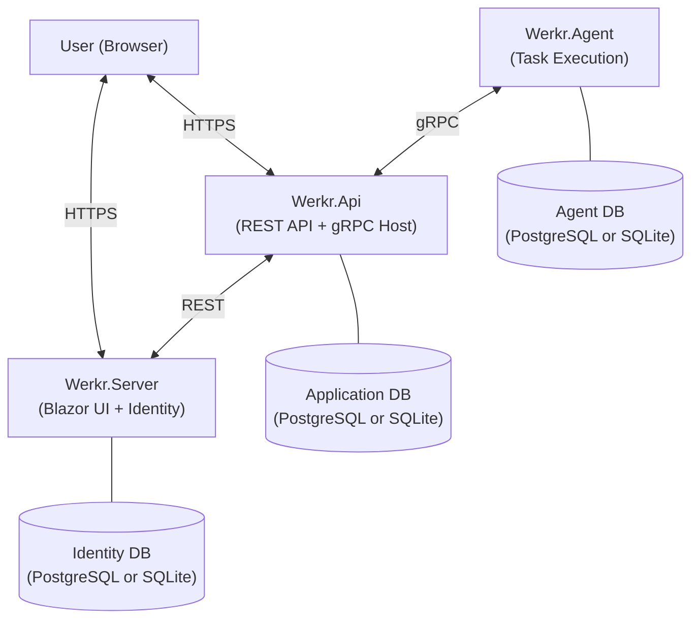
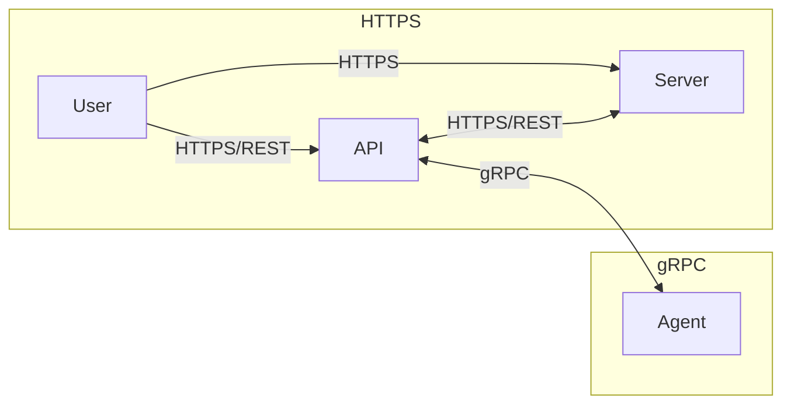

# Outdated
This document is outdated and needs to be revised.

# Architecture

This document describes the stable architectural boundaries of the Werkr project. It covers the system topology, communication model, and key design decisions at a conceptual level. For class-level detail, see the [API documentation](https://docs.werkr.app/api/index.html). For vulnerability reporting, see [SECURITY.md](SECURITY.md). For encryption, key management, and secret storage details, see the [Security Architecture](articles/SecurityOverview.md).

---

## System Overview

Werkr is a task automation and workflow orchestration platform built on three primary components. The Server and API expose HTTPS endpoints; the API and Agent communicate over encrypted gRPC.

- **Werkr.Server** — The Blazor Server UI and identity provider. Handles user authentication (ASP.NET Identity with RBAC and TOTP 2FA), renders the management interface, and exposes REST endpoints consumed by the API. Owns the identity database. Has no direct communication with the Agent.
- **Werkr.Api** — The central application API. Owns the primary application database (tasks, schedules, workflows, connections, job results). Exposes HTTPS REST endpoints to both end users and the Server. Hosts gRPC services for bidirectional communication with agents (schedule sync, job reporting, command dispatch).
- **Werkr.Agent** — The worker process that executes tasks. Hosts an embedded PowerShell runtime, runs shell commands, and dispatches built-in actions. Hosts gRPC services that the API calls to push schedule invalidations, heartbeats, key rotations, fetch job output, and stream action/shell execution logs. Maintains its own local application database for cached state.

---

## Project Map

| Project | Role |
|---------|------|
| `src/Werkr.Server/` | Blazor Server UI, ASP.NET Identity, SignalR, user authentication and authorization |
| `src/Werkr.Api/` | REST API, gRPC service host, schedule/task/workflow CRUD, connection management |
| `src/Werkr.Agent/` | Task execution engine, PowerShell host, shell executor, built-in action handlers |
| `src/Werkr.Core/` | Shared business logic — scheduling, workflows, registration, cryptography, security |
| `src/Werkr.Common/` | Shared models, protobuf definitions, auth policies, rendering utilities |
| `src/Werkr.Common.Configuration/` | Strongly-typed configuration classes for Server, Agent, and UI settings |
| `src/Werkr.Data/` | EF Core database contexts (PostgreSQL + SQLite), entities, migrations, seeding |
| `src/Werkr.Data.Identity/` | ASP.NET Identity EF Core contexts, roles, permissions, identity entities |
| `src/Werkr.AppHost/` | .NET Aspire orchestrator for local development — wires up PostgreSQL, API, Agent, and Server |
| `src/Werkr.ServiceDefaults/` | Aspire service defaults — OpenTelemetry, health checks, service discovery, resilience |
| `src/Installer/Msi/` | WiX-based MSI installers and custom actions for Windows deployment |

---

## Communication Model

Werkr uses two distinct communication protocols depending on which components are talking:

| Path | Protocol | Purpose |
|------|----------|---------|
| **User → Server** | HTTPS | Browser sessions (Blazor Server + SignalR) |
| **User → API** | HTTPS/REST | Direct REST API access |
| **API ↔ Server** | HTTPS/REST | The API calls Server REST endpoints; the Server is not aware of agents |
| **API ↔ Agent** | gRPC over TLS | All agent interaction — registration, schedule sync, job reporting, command dispatch |

The Server has **no direct communication** with the Agent. All agent management flows through the API.

### HTTPS Endpoints

**Server** hosts Blazor Server pages, ASP.NET Identity endpoints (login, 2FA, user management), and a SignalR hub for real-time UI updates.

**API** exposes minimal-API REST endpoints under `/api/` for agents, tasks, schedules, workflows, connections, diagnostics, and authentication proxy. Both end users and the Server consume these endpoints over HTTPS.

### gRPC Services

All gRPC communication is between the API and Agent only. After initial registration, every gRPC payload is wrapped in an `EncryptedEnvelope` — the inner protobuf message is serialized and encrypted with a shared symmetric key established during registration. A `key_id` field supports key rotation so the receiver can accept either the current or previous key during a transition window.

Services are split by direction and responsibility. See `src/Werkr.Common/Protos/` and `src/Werkr.Agent/Protos/` for the full `.proto` definitions.

**API-hosted services** (Agent → API):
- **AgentRegistration** — One-time agent registration handshake (see [Registration Flow](#registration-flow) below). Defined in `src/Werkr.Api/Protos/Registration.proto`.
- **ScheduleSync** — Agent pulls assigned schedules and holiday dates, submits audit logs. Defined in `ScheduleSync.proto`.
- **JobReporting** — Agent reports completed job results with output previews. Defined in `JobReport.proto`.
- **WorkflowExecution** — Agent requests the API to start a workflow run. Defined in `WorkflowExecution.proto`.

**Agent-hosted services** (API → Agent):
- **ConnectionManagement** — Heartbeat, server URL change notifications, shared key rotation. Defined in `ConnectionManagement.proto`.
- **ScheduleInvalidation** — Push notifications when a schedule is modified or deleted. Defined in `ScheduleInvalidation.proto`.
- **OutputFetch** — Retrieves full job output logs from the agent on demand. Defined in `OutputFetch.proto`.
- **Action** — Streams execution of a built-in action on the agent. Defined in `src/Werkr.Agent/Protos/Action.proto`.
- **Shell** — Streams execution of a shell/PowerShell command on the agent. Defined in `src/Werkr.Agent/Protos/Shell.proto`.

---

## Registration Flow

Agent registration uses an admin-carried bundle model with hybrid asymmetric + symmetric encryption:

1. An administrator creates a **registration bundle** on the Server. The bundle contains a correlation token and the Server's public key.
2. The administrator transfers the bundle to the Agent (out-of-band).
3. The Agent decrypts the bundle, generates its own key pair, and calls the `RegisterAgent` RPC on the API. The request includes the Agent's public key (hybrid-encrypted with the Server's public key), the Agent's gRPC URL, and a human-readable name.
4. The API validates the bundle correlation token, decrypts the Agent's public key, generates a shared symmetric key, and returns it hybrid-encrypted with the Agent's public key.
5. Both sides store the shared key. All subsequent gRPC payloads use `EncryptedEnvelope` with this shared key.

Key rotation is supported via the `RotateSharedKey` RPC.

For implementation detail, see `src/Werkr.Core/Registration/` and the protobuf definitions in `src/Werkr.Api/Protos/Registration.proto`.

---

## Database Strategy

Werkr is designed to support both **PostgreSQL** and **SQLite** as interchangeable database providers. Any component — Server, API, or Agent — can use either provider, selected at deployment time via configuration. The default configuration uses PostgreSQL for the API and Server, and SQLite for the Agent. This allows flexible deployment topologies ranging from a full PostgreSQL cluster to a fully self-contained SQLite setup.

The data layer is organized into two database contexts:

- **Application database** (`WerkrDbContext`) — Stores tasks, schedules, workflows, connections, job results, holiday calendars, and audit logs. The API and Agent each use their own instance of this context. The Agent uses a subset of the same schema to cache schedules and local state. Managed by `PostgresWerkrDbContext` or `SqliteWerkrDbContext` in `src/Werkr.Data/`.
- **Identity database** (`WerkrIdentityDbContext`) — Stores users, roles, and permissions (ASP.NET Identity). Used by the Server. Managed by `PostgresWerkrIdentityDbContext` or `SqliteWerkrIdentityDbContext` in `src/Werkr.Data.Identity/`.

Both PostgreSQL and SQLite context classes share a common base class and entity model. The provider-specific subclasses handle migration paths and naming conventions (snake_case for PostgreSQL via `EFCore.NamingConventions`).

EF Core migrations are maintained separately per provider.
- `src/Werkr.Data/Migrations/Postgres/`
- `src/Werkr.Data/Migrations/Sqlite/`
- `src/Werkr.Data.Identity/Migrations/`

---

## Scheduling & Workflows

### Scheduling

Schedules support daily, weekly, and monthly recurrence patterns with repeat intervals, start/end time windows, and time zone awareness. A **Holiday Calendar** system allows schedules to skip or shift occurrences on configured holidays, with audit logging for suppressed occurrences.

See `src/Werkr.Core/Scheduling/` for the schedule calculator, holiday date service, and occurrence result types.

### Workflows

Workflows are directed acyclic graphs (DAGs) of task steps. Each step references a task, declares dependencies on other steps, and can have control statements and condition expressions. The `WorkflowExecutor` performs topological ordering of steps, evaluates dependencies using configurable `DependencyMode` settings, and dispatches tasks to agents.

The `ConditionEvaluator` handles branching logic within workflows — steps can be conditionally executed based on the outcomes of their dependencies.

See `src/Werkr.Core/Workflows/` for the executor, condition evaluator, and run tracker.

---

## Security Model

Security is layered throughout the system. This section provides a high-level overview; for vulnerability reporting, see [SECURITY.md](SECURITY.md). For full details on each layer — cryptographic primitives, registration flow, envelope encryption, secret storage, and authentication — see the [Security Architecture](articles/SecurityOverview.md).

| Layer | Description |
|-------|-------------|
| **Transport** | All HTTP and gRPC connections require TLS. |
| **Payload encryption** | Every gRPC payload after registration is encrypted inside an `EncryptedEnvelope` using a shared symmetric key. |
| **Registration** | Admin-bundle model with hybrid asymmetric + symmetric encryption for initial key exchange. |
| **Key rotation** | Periodic shared key rotation via the `RotateSharedKey` RPC, with a grace period for in-flight messages. |
| **Authentication** | Server uses JWT bearer tokens (ASP.NET Identity). Agents authenticate via their registered shared key. |
| **Authorization** | Permission-based policy authorization (RBAC). See `src/Werkr.Common/Auth/` for policies. |
| **2FA** | Built-in TOTP two-factor authentication for user accounts. |
| **Path allowlisting** | Agents validate file paths against a configurable allowlist before execution. |
| **Secret storage** | OS-native secret stores per platform. See `src/Werkr.Core/Security/`. |

---

## Aspire Integration

For local development, `src/Werkr.AppHost/` provides a .NET Aspire orchestrator that wires up:
- A PostgreSQL container with two databases (`werkrdb` and `werkridentitydb`)
- The API service (depends on `werkrdb`)
- The Agent (depends on `werkrdb`)
- The Server (depends on API, Agent, and `werkridentitydb`)

`src/Werkr.ServiceDefaults/` adds standard Aspire behaviors to each service: OpenTelemetry (logging, metrics, tracing), health check endpoints (`/health` and `/alive`), service discovery, and HTTP client resilience.
