This document is intended to show you the Werkr Agent Windows MSI installer process and highlight key details.

To get started download the CPU appropriate MSI file from the [github releases](https://github.com/DarkgreyDevelopment/Werkr.Agent/releases/tag/latest) page. Note that if you're not sure which msi file to download then you probably want the x64 version.

 

# Msi Installation

1. Double Click the Msi installer and select Next.
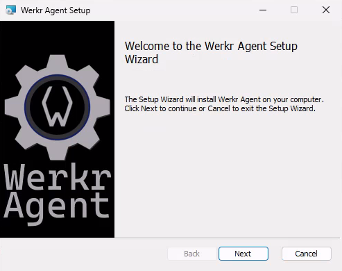

 

2. Specfy agent settings.
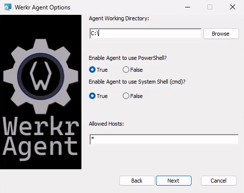

* The `Agent Working Directory` setting determines the default path for scripts and commands to start from.
* The `Enable Agent to use PowerShell` setting determines whether the agent will enable the built in PowerShell host & its associated grpc communications channel.
* The `Enable Agent to use System Shell  (cmd)` setting determines whether the agent will enable the built in command process host & its associated grpc communications channel.
* Note that if you turn both PowerShell and the System Shell services off then the agent will only be able to perform System Defined actions.
* The `Allowed Hosts` settings determines which hosts are allowed to communicate with the agent.
  * Leave this as `*` to enable all outside servers to communicate with this agent.
  * This list is semi-colon delimited. Ex: `example.com;localhost;192.168.1.16`

 

3. Select Certificate Type from dropdown.
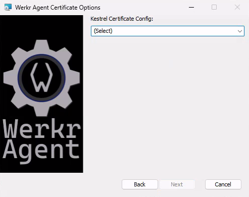
* Regardless of which certificate type you choose, you will need to enter the Url that you want the agent to listen on.
  * Once populated, You may need to click out of the Certificate Url field for the "Next" button to become enabled.

<ul>

  
CertStore (expand)

  1. 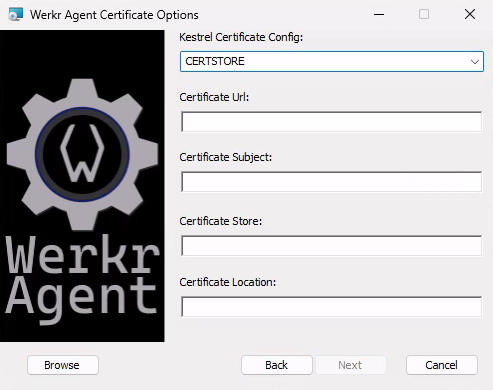
    1. If you know your certificates store information then you can feel free to paste it into the fields.
    2. Otherwise select the browse button on the bottom left and you can select the appropriate certificate from the ones availabe in the store.
  2. 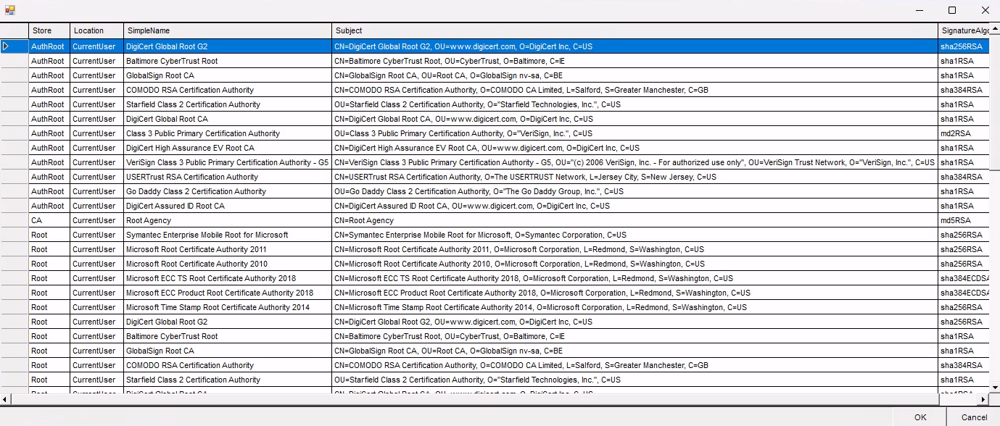

</ul>

<ul>

  
CertFile (expand)

  1. 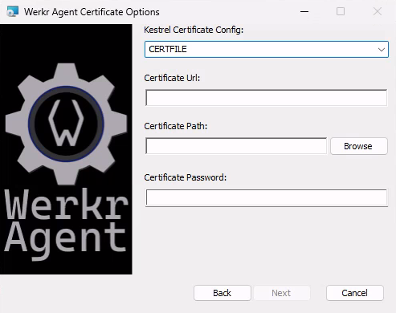
  2. 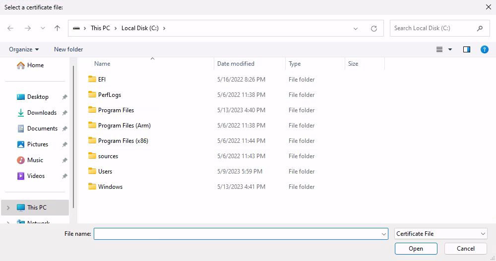

</ul>

<ul>

  
CertAndKeyFile (expand)

  1. 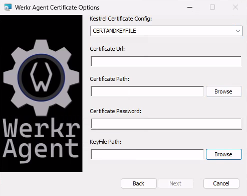
  2. 

</ul>

 

4. Specify logging levels. It is suggested that you leave these at their default values unless you have a specific reason to change them.
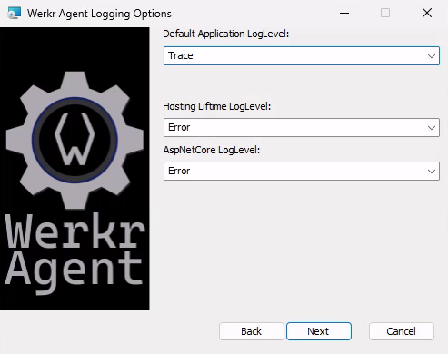

 

5. Select Install Path - You can choose any location you want the application to be installed at.
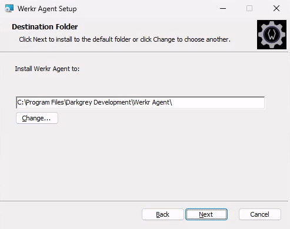

 

6. Select Install
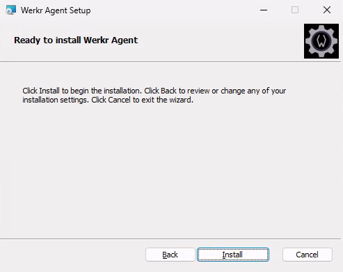
The installer will now
  * Extract the portable application files
  * Populate the appsettings file with the settings you selected
  * Register the application as a windows service
  * Register installation details with windows to allow for a simple uninstall.

 

7. Installation Complete, Select Finish!
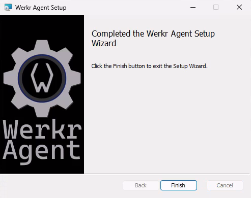

  

# Post Install & Removal

After installation you can find the application registered under the `Programs and Features` control panel menu, as well as under the `Installed Apps` menu.

The application has also been registered as a windows service.

<ul>

  
Service Info (expand)

  1. 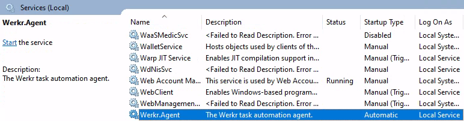

  Interact with the service (start/stop/disable) via the Windows Services mmc snapin.

</ul>

 

## Msi Removal:

The application can be removed by selecting the `Uninstall` button from either the `Programs and Features` or `Installed Apps` menus.

<ul>

  
Programs and Features (expand)

  1. 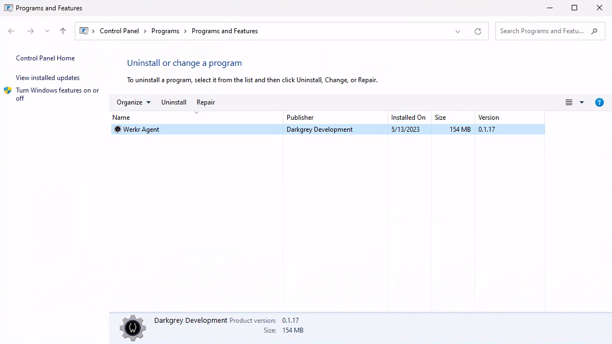

</ul>

<ul>

  
Installed Apps (expand)

  1. 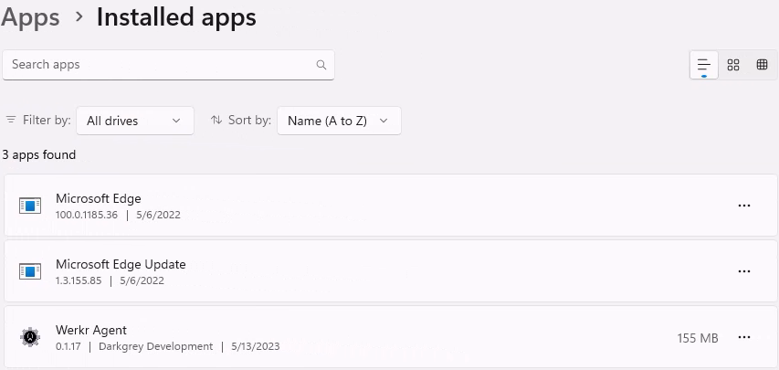
  The `uninstall` button in this menu is hidden until you select the elipses menu on the right side of the screen.

</ul>

 

Please note that after uninstalling the application you may still have a `Werkr Agent` directory in the install location.
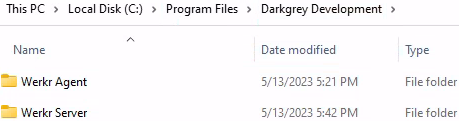
This directory should only contain leftover log files that were generated by the application during its operation.
You can feel free to delete this directory and its contents after the uninstall wizard has completed successfully.

 

## Portable Removal
If you downloaded the portable version of the application then it can be "uninstalled" simply by deleting the folder that has the application files.

 
